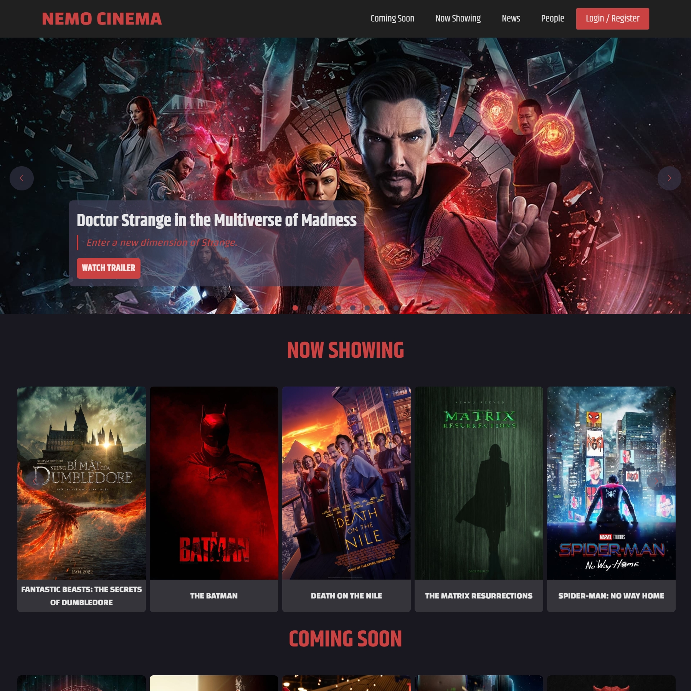
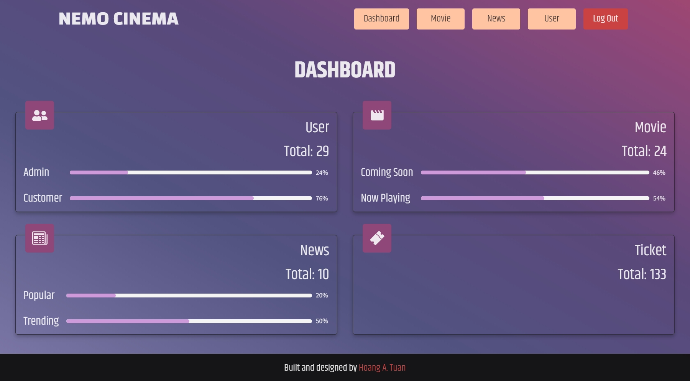

<h1 align="center">Nemo Cinema</h1>

<h3 align="center">URL: <a href="https://nemocinema.vercel.app/" target="_blank">https://nemocinema.vercel.app/</a></h3>

<h3 align="center">
  <a href="#sparkles-features">Features</a> &#xa0; | &#xa0;
  <a href="#sparkles-technologies">Technologies</a> &#xa0; | &#xa0;
  <a href="#sparkles-demo">Demo</a> &#xa0; | &#xa0; 
  <a href="https://anhtuan.vercel.app/">Author</a>
</h3>

<h3 align="center">API from 
<a href="https://cybersoft.edu.vn/">CyberSoft</a>, 
<a href="https://www.themoviedb.org/">The Movie Database</a> and 
<a href="https://github.com/tuanhngf/my-api-v1">my-api-v1</a>.</h3>

## :sparkles: Features 

<h3>:rocket: Home</h3>

- Login / Register
- Booking ticket
- Showing movie details, watch trailer
- Showing news about movies
- Showing actors detail
- Showing booking history
- Showing, update users information
- Responsive app

<h3>:rocket: Admin</h3>

- Show lists of movies, users, news
- Add movie, user, news
- Add showtime movies
- Update movie, user, news

## :sparkles: Technologies

- React
- Redux
- React Router
- Ant Design
- Styled Components

## :sparkles: Demo

<a href="#top">Back to Top</a>

